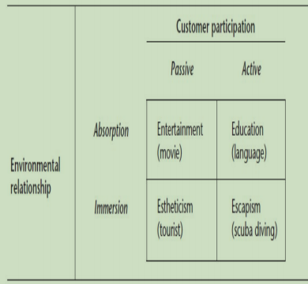
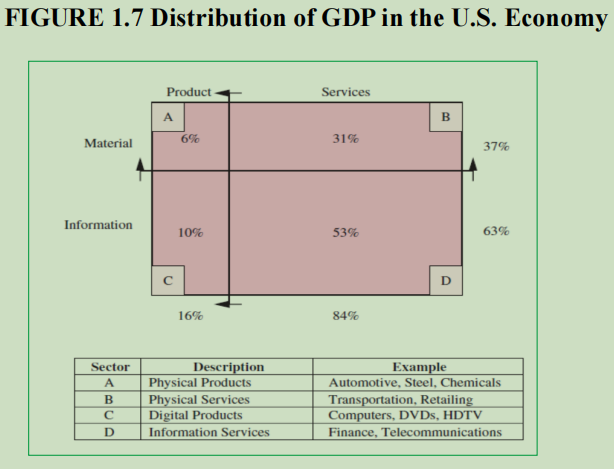

# The Role of Services in the Economy - Detailed Notes

## 1. Understanding Services

- Services are central to national economies and global commerce.
- No economy functions without key services like transportation, communication, education, and healthcare.
- As economies develop, most people work in service industries.
- Service operations are unique because customers are directly involved in service delivery.
- Service firms face low barriers to entry, making competitive strategy crucial.

## 2. Common Traits of Services

- **Intangibility**: Services cannot be touched or stored.
- **Simultaneous Consumption**: Services are produced and consumed at the same time.
- **Customer Involvement**: The customer plays an active role in service delivery.
- **Time-Perishable**: Unused service capacity is lost forever (e.g., an empty airline seat).

## 3. Facilitating Role of Services in an Economy

- Infrastructure services (transport, communication) connect economic sectors.
- Specialized firms provide business services (e.g., banking, IT) more efficiently than manufacturing firms handling them in-house.
- Examples:
  - Banking enables fund transfers.
  - Transport moves goods to places where they aren’t produced.
  - Personal services (lodging, childcare) commercialize household tasks.
  - Government services ensure economic stability (education, healthcare, law enforcement).
- Manufacturing profits increasingly depend on value-added services (e.g., auto financing, maintenance contracts).

## 4. Economic Evolution

- **Early 1900s**: 30% of U.S. workforce in services, majority in agriculture and industry.
- **1950s**: Services employ 50% of workforce.
- **Today**: 80% of workforce in services.
- **Clark-Fisher Hypothesis**: Employment shifts from agriculture → industry → services as productivity increases.

## 5. Stages of Economic Development

### Preindustrial Society

- Economy based on agriculture, mining, fishing.
- Productivity is low; labor-intensive work.
- Natural resources and climate dictate output.

### Industrial Society

- Focus shifts to manufacturing and goods production.
- Division of labor and mechanization increase efficiency.
- Standard of living measured by quantity of goods produced.
- Time management and schedules become critical.

### Postindustrial Society

- Emphasis on quality of life through services (health, education, recreation).
- **Factors driving postindustrial society:**
  1. **Growth of essential services** (e.g., utilities, transportation).
  2. **Rise of non-manufacturing jobs** (e.g., maintenance, IT support).
  3. **Higher incomes create demand for services** (entertainment, travel).
  4. **Education becomes key for economic progress** (knowledge-based work).

## 6. Growth of the Service Sector

- Shift from blue-collar to white-collar jobs.
- Essential services (education, healthcare, banking) are recession-resistant.
- Service industries drive employment in modern economies.
- 21st-century careers see rapid growth in healthcare, social assistance, and professional services.

## 7. Experience Economy

- The economy moves from basic services to experience-driven engagements.
- **Consumer Services:**
  - Value added through memorable, engaging experiences.
  - Example: Watching a movie (low involvement) vs. scuba diving (high involvement).
- **Business Services:**
  - Value comes from collaboration and co-creation with customers.
  - Example: IT consulting and cloud services.
- **Three key elements of business service experience:**

  1. **Co-creation**: Customers actively shape the service.
  2. **Relationship building**: Long-term customer relationships drive innovation.
  3. **Service capability**: Balancing demand and quality of service.

  

## 8. Sources of Service Sector Growth

- **Technological Advances:**
  - Digital services dominate economies (e.g., online banking, telemedicine).
  - Services like remote healthcare consultations and online education are growing rapidly.
- **Innovation:**
  - Push theory: Technology-driven innovations (e.g., DVDs creating video rental businesses, Netflix revolutionizing rentals).
  - Pull theory: Innovations based on customer demand (e.g., hotels offering airport shuttles due to high demand for taxis).
- **Impact of IT on Service Delivery:**

  - Reduces need for physical proximity (e.g., online banking, remote medical diagnostics).
  - Enhances efficiency in service delivery.

  

## 9. Innovation in Services

- **Technology-Driven (Push Innovation):**
  - Innovation starts in research labs (e.g., Post-it notes from failed adhesive experiments).
  - Many tech advancements lead to new services (e.g., the internet enabling e-commerce and social media).
- **Customer-Driven (Pull Innovation):**
  - Service ideas emerge from frontline employee observations (e.g., hotels adding airport shuttles based on demand).
  - Data-driven service development (e.g., auto part sales data predicting car failures, leading to preventive maintenance services).

## 10. Service Benchmark: Walmart’s Success

- First service company to top Fortune 500.
- Shift in global economy as services now dominate over manufacturing.
- 51 of the top 100 companies on Fortune 500 are service businesses.
- Line between manufacturing and services blurring as manufacturers integrate services (e.g., maintenance, financing).

## 11. Future of Services

- **Aging Population:** Demand for healthcare, financial planning, and wellness services will rise.
- **Investment Management:** Shift from pensions to defined contribution plans increases demand for financial advisory services.
- **Leisure Economy:** More disposable income and free time drive demand for travel, hospitality, and entertainment services.
