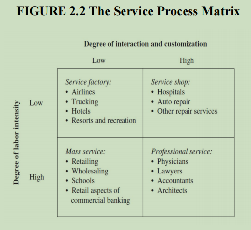
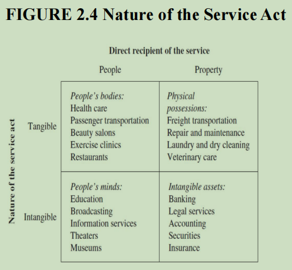
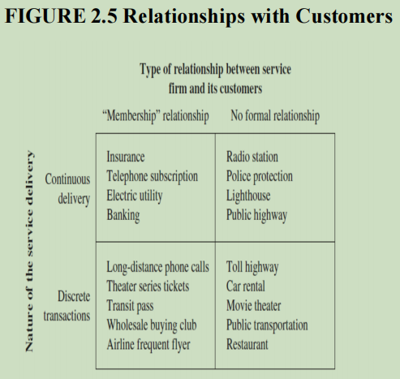
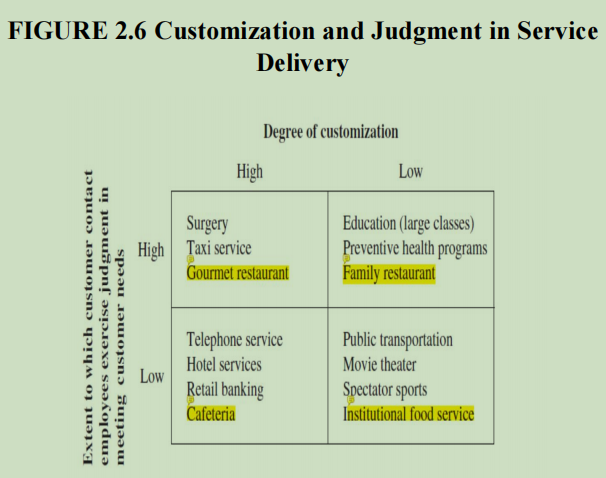
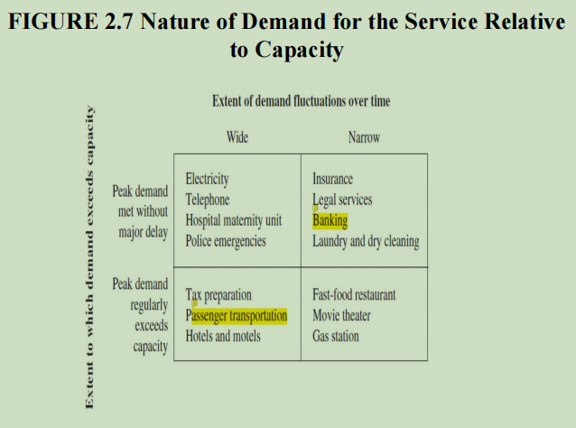
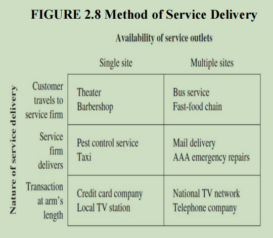

# The Nature of Services

## 1. Service-Product Bundle

- A service-product bundle includes both goods and services.
- Example: A TV purchase includes installation services.
- Manufacturers use service add-ons to increase revenue, a strategy called _servitization_.
- After-sales service contracts help generate predictable cash flow.

## 2. Characteristics of Service Operations

### Customer Participation

- Customers actively take part in service processes.
- Facility design must consider customer experience.
- Example: Fast-food chains reduce staff by letting customers place orders and clean tables.
- Some services open "back office" processes to customers (e.g., open kitchens in restaurants).
- Customers’ knowledge and actions impact service efficiency.
- Example: A doctor's diagnosis depends on accurate patient-provided information.

### Simultaneity

- Services are created and consumed at the same time.
- They cannot be stored for later use.
- Example: A hotel room left vacant for a night loses revenue permanently.
- Unlike manufacturing, services cannot rely on inventory as a demand buffer.
- Strategies to handle demand fluctuations:
  - Reservations and scheduling
  - Incentives for off-peak usage (e.g., discounted evening phone calls)
  - Demarketing peak times (e.g., early holiday shopping promotions)

### Perishability

- Services disappear if not used.
- Example: An empty airline seat represents lost revenue.
- Managing capacity involves:
  - Hiring part-time staff during peak hours.
  - Adjusting shift schedules to match demand.
  - Increasing customer self-service to handle peak loads.
  - Allowing customer wait times (risking dissatisfaction).

### Intangibility

- Services are experiences, not tangible products.
- Cannot be patented, requiring firms to rapidly expand to maintain a competitive edge.
- Franchising helps in establishing market presence.
- Customers rely on reputation and trust when purchasing services.
- Government regulations ensure minimum quality standards (e.g., doctor licensing, engineering certifications).

### Heterogeneity

- Service experiences vary across customers.
- Personalization opportunities exist, but variability may affect perceived quality.
- Employee training ensures consistency.
- Customers expect fair and equal treatment.
- Example: Personalized banking services may improve loyalty but should maintain service consistency.
- Customer feedback is essential for maintaining quality.
- Employee attitude impacts service delivery; unhappy employees lead to poor service.
- Example: A disgruntled airline staff member can harm customer satisfaction significantly.

## 3. Non-Ownership of Services

- Customers do not own services; they rent access.
- Examples:
  - A hotel stay is temporary access, not ownership.
  - Airline passengers pay for a seat for a single trip.
  - Streaming services provide temporary access to digital content.
- Managing shared resources involves:
  - Maintaining facilities between customer uses (e.g., hotel housekeeping, airline seat cleanup).
  - Queue management to control waiting times (e.g., theme park ride reservations).
- For labor-based services, maintaining skill levels and minimizing idle labor hours is crucial.
- Network-based services must ensure uptime for continuous availability.

## 4. Service Package Components

- **Supporting Facility**: Physical resources required (e.g., hospital, golf course).
- **Facilitating Goods**: Materials consumed by customers (e.g., medical supplies, rental cars).
- **Information**: Data required for service delivery (e.g., patient records, airline seat availability).
- **Explicit Services**: Tangible benefits (e.g., pain relief after a dentist visit).
- **Implicit Services**: Psychological benefits (e.g., Ivy League degree status, confidence in security measures).

## 5. Classification of Services

### Service Process Matrix

- Two key dimensions:

  - **Labor Intensity**: Ratio of labor cost to capital investment.
  - **Customization & Customer Interaction**: Level of personal interaction required.

    

- Categories:
  - **Service Factory** (low labor, low customization): Airlines, hotels.
  - **Service Shop** (high capital, high customization): Hospitals, repair services.
  - **Mass Service** (high labor, low customization): Retail, schools.
  - **Professional Service** (high labor, high customization): Lawyers, doctors.

### Strategic Classification of Services

- **Nature of the Service Act**:

  - Tangible actions on customers (e.g., transportation, haircuts).
  - Tangible actions on possessions (e.g., dry cleaning, car repair).
  - Intangible actions on customers (e.g., education, consulting).
  - Intangible actions on assets (e.g., investment advice, insurance).

  

- **Customer Relationship Management**:

  - Long-term relationships benefit both firms and customers.
  - Example: Membership-based services like Amazon Prime.

  

- **Customization & Judgment**:

  - Varies across industries (e.g., fast food vs. fine dining customization levels).

  

- **Demand & Capacity Management**:

  - Predictable vs. unpredictable fluctuations.
  - Strategies include adjusting service capacity, price incentives, and shifting demand.

  

- **Service Delivery Methods**:

  - Location-based (e.g., in-person banking) vs. remote (e.g., online banking, ATMs).
  - Managing multiple sites for consistency and efficiency.

  

## 6. Open-Systems View of Services

- Services require unique management techniques beyond traditional manufacturing.
- Customers are active participants in service operations.
- Service managers must balance operational efficiency and marketing.
- **Marketing roles in services**:
  - Educating customers on their role in service delivery.
  - Influencing demand to match capacity.
- **Challenges in Service Operations**:
  - Employees interact directly with customers, requiring training and empowerment.
  - Measuring service quality is complex since it is based on customer experience.
- **Customer Experience Considerations**:
  - Facility aesthetics, waiting time management, and overall service ambiance affect perception.
  - Example: Hotel atmosphere impacts guest satisfaction as much as room quality.

## 7. Summary

- Service operations differ from manufacturing due to customer participation, real-time delivery, and demand variability.
- Managers must integrate marketing and operations for efficient service delivery.
- Employee training and positive attitude are critical to service quality.
- The service process itself is a major part of the final product.
- Understanding customer expectations and adapting to them ensures long-term success in service industries.
