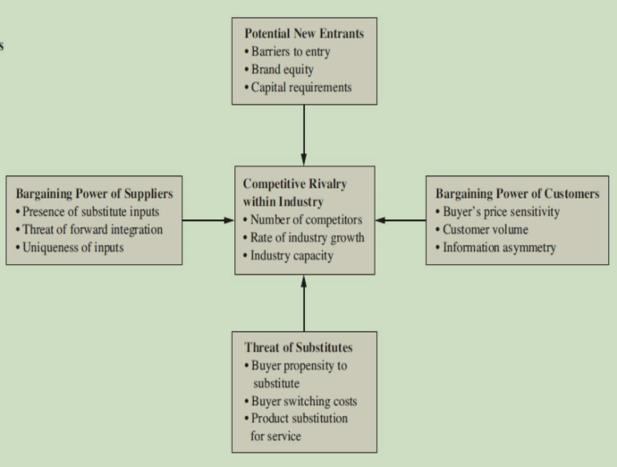
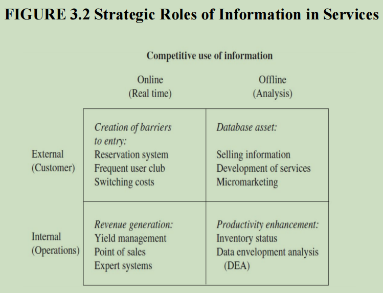

[<< Previous](https://eclairjit.github.io/intro-to-operations-management/2_Nature_of_services)

# Service Strategy - Detailed Notes

## 1. Competitive Environment of Services

- Services operate in a rapidly changing, competitive environment.
- Information technology is transforming industries, shifting focus from industrial to service economies.
- Global communication and data processing are key factors in competitive services.
- Example: Kmart uses IT to track sales, inventory, and credit authorizations.

## 2. Strategic Service Vision

- Defined by:
  - **Target Market**: Who the service is for.
  - **Service Concept**: The value provided.
  - **Operating Strategy**: How services are delivered.
  - **Delivery System**: Infrastructure supporting operations.
- Example: Southwest Airlines’ initial strategy focused on limited cities and low-cost services.

## 3. Competitive Challenges in Services

- **Low Entry Barriers**: Services are hard to patent; new entrants can easily copy innovations.
- **Limited Economies of Scale**: Physical presence limits expansion.
- **Erratic Sales Fluctuations**: Demand varies by time, making consistency hard.
- **Product Substitution**: New products can replace services (e.g., home pregnancy tests replacing clinics).
- **Customer Loyalty**: Established firms retain customers through personalized services.
- **Exit Barriers**: Nonprofit-driven businesses may operate despite low profits.

## 4. Competitive Service Strategies

### Overall Cost Leadership

- Efficient facilities, cost control, and technology-based services.
- **Approaches:**
  - Target low-cost customers (e.g., USAA insurance for military personnel).
  - Standardizing custom services.
  - Reducing human involvement (e.g., ATMs replacing bank tellers).
  - Network cost efficiency (e.g., FedEx hub-and-spoke model).
  - Taking service operations offline (e.g., remote shoe repair kiosks).

### Differentiation Strategy

- Creating unique service offerings to stand out.
- **Techniques:**
  - Making intangible services tangible (e.g., hotel toiletries with branding).
  - Customizing standard services (e.g., personalized hotel greetings).
  - Reducing perceived risk (e.g., warranty guarantees, clean facilities).
  - Investing in employee training for better service.
  - Controlling service quality across multiple locations.

### Focus Strategy

- Servicing a niche market exceptionally well.
- **Examples:**
  - USAA focuses only on military families.
  - FedEx dominates overnight deliveries.
  - Specializing in high-value customer needs.

## 5. Strategic Analysis

### Porter’s Five Forces Analysis

- **Competitive Rivalry**: Intense price wars, branding, and innovation drive competition.
- **New Entrants**: Profitable markets attract new competitors.
- **Threat of Substitutes**: Products may replace services (e.g., TurboTax replacing tax consultants).
- **Supplier Power**: Large service firms like Netflix leverage bulk purchases to reduce supplier power.
- **Buyer Power**: Customers influence pricing; loyalty programs counteract this power.

### SWOT Analysis

- **Strengths**: Competitive advantages, unique service elements.
- **Weaknesses**: Areas requiring improvement.
- **Opportunities**: New markets and technologies.
- **Threats**: Competitor actions and economic shifts.

## 6. Winning Customers

- **Key Factors in Service Selection:**
  - **Availability**: Ease of access (e.g., ATMs, online services).
  - **Convenience**: Location and operating hours.
  - **Dependability**: Reliability of service (e.g., on-time flights).
  - **Personalization**: Custom experiences (e.g., greeting customers by name).
  - **Price**: Competitive yet value-driven pricing.
  - **Quality**: Meeting or exceeding customer expectations.
  - **Reputation**: Word-of-mouth and past experiences matter.
  - **Safety**: Particularly critical in industries like healthcare and aviation.
  - **Speed**: Faster services appeal to time-sensitive customers.

### Service Qualifiers, Winners, and Losers

- **Qualifiers**: Basic standards a service must meet (e.g., airline safety).
- **Winners**: Attributes that attract customers (e.g., low price, reputation).
- **Losers**: Failures that drive customers away (e.g., bad customer service, long wait times).

## 7. Competitive Role of Information in Services

### Creating Barriers to Entry

- **Reservation Systems**: Securing repeat business through technology.
- **Loyalty Programs**: Encouraging customer retention.
- **Switching Costs**: Making it inconvenient to change providers (e.g., direct billing setups in hospitals).

### Revenue Generation

- **Yield Management**: Maximizing revenue through dynamic pricing (e.g., airline ticket pricing changes).
- **Point of Sale Tech**: Speeding up transactions (e.g., restaurant handheld ordering systems).
- **Expert Systems**: AI-driven diagnostics (e.g., Otis Elevator remote maintenance diagnostics).

### Database as an Asset

- **Selling Information**: Companies like American Express monetize customer spending data.
- **Developing Services**: Data-driven service evolution (e.g., Club Med adjusting for changing customer demographics).
- **Micromarketing**: Targeting individuals based on behavior patterns.

### Productivity Enhancement

- **Inventory Management**: Real-time tracking improves stock management (e.g., Frito-Lay using handheld scanners).
- **Data Envelopment Analysis (DEA)**: Measuring service efficiency across locations.

## 8. Virtual Value Chain

- Services operate in both the **marketplace** (physical world) and **marketspace** (digital world).
- **Stages of Virtual Value Creation:**
  1. **New Processes**: Digital transformation improves efficiency.
  2. **New Knowledge**: Virtual alternatives replace traditional processes (e.g., online banking vs. branch visits).
  3. **New Products**: Data insights drive new service offerings.
  4. **New Relationships**: Customers engage in co-creation of value.

## 9. Limits of Using Information

- **Anticompetitive Practices**: Loyalty programs may restrict fair competition.
- **Fairness Concerns**: Dynamic pricing may lead to unfair pricing differences.
- **Privacy Issues**: Micromarketing can feel invasive.
- **Data Security**: Personal information must be protected.
- **Reliability Risks**: Errors in data could lead to incorrect decisions.

## 10. Service Firm Competitiveness Stages

1. **Available for Service**: Minimal investment, reactive approach, often seen in government services.
2. **Journeyman**: Competitive due to industry standards but lacks innovation.
3. **Distinctive Competence Achieved**: Proactive improvements and strong operational strategies.
4. **World-Class Service Delivery**: Setting industry benchmarks, exceeding expectations, and using tech for competitive advantage.

## 11. Summary

- Service strategy focuses on cost, differentiation, and niche targeting.
- Strategic planning tools like SWOT and Five Forces analysis help assess competitiveness.
- Information technology is a key driver of competitive advantage in modern services.
- World-class service firms define industry standards and focus on continuous improvement.

[Next >>](https://eclairjit.github.io/intro-to-operations-management/4_Relevance_of_Operations_Management)
