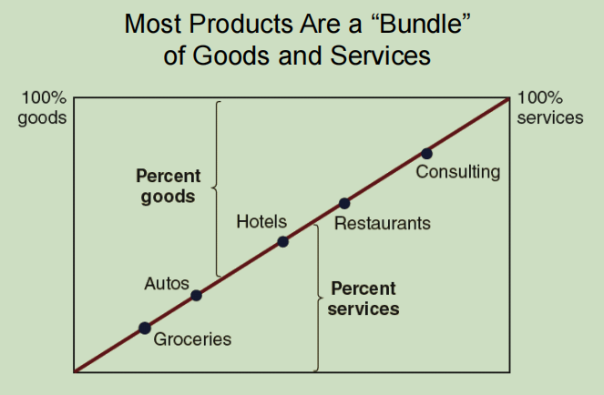

[<< Previous](https://eclairjit.github.io/intro-to-operations-management/3_Service_Strategy)

# Relevance of Operations Management - Detailed Notes

## 1. Introduction to Operations Management (OM)

- **Definition**: OM is the management of the transformation process that converts inputs (labor, raw materials) into outputs (goods, services).
- **Objectives**:
  - Improve productivity and efficiency.
  - Enhance quality of goods and services.
  - Contribute to economic growth and job creation.
  - Integrate with other business functions (marketing, finance, HR).
- **Key Trends**:
  - Globalization and increased competition.
  - E-commerce and digital transformation.
  - Higher customer expectations.
  - Cost reduction through lean operations.

## 2. Managerial Issues in OM

- **Shift in power to consumers**:
  - Customers demand better quality and faster delivery.
  - Digital platforms give consumers more choices.
- **Productivity challenges**:
  - Balancing cost, quality, and speed.
  - Reducing labor and material costs without sacrificing efficiency.
  - Implementing advanced technologies like automation.

## 3. OM Strategy: A Top-Down Approach

- **Strategic (Long-Range)**:
  - Capacity planning.
  - Aligning operations with business goals.
- **Tactical (Medium-Range)**:
  - Scheduling and resource management.
- **Operational (Short-Range)**:

  - Execution of tasks and activities.
  - Managing daily operations.

  

## 4. Transformation Process in OM

- **Types of Transformations**:

  - **Physical**: Manufacturing.
  - **Locational**: Transportation and logistics.
  - **Exchange**: Retailing.
  - **Storage**: Warehousing.
  - **Physiological**: Healthcare.
  - **Informational**: Telecommunications, IT services.

  

## 5. Contributions of OM to Society

- **Higher Standard of Living**:
  - Increased productivity leads to lower costs.
- **Improved Quality of Goods and Services**:
  - Competitive markets drive better quality.
- **Environmental Sustainability**:
  - Recycling and sustainable production.
- **Better Working Conditions**:
  - Improved job design and employee participation.

## 6. The Emergence of OM

- **Historical Development**:
  - **Pre-1900**: Cottage industries and handmade goods.
  - **Industrial Revolution**: Mechanization and mass production.
  - **Scientific Management (Frederick Taylor)**: Standardization and efficiency.
  - **Operations Research (WWII Era)**: Logistics and quantitative decision-making.
  - **Modern OM**: Integration with IT, lean management, and automation.
- **OM in Services**:
  - Batch cooking (e.g., McDonald’s).
  - Just-in-Time (JIT) inventory management.
  - Automated restocking (e.g., Walmart).

## 7. Differences Between Goods and Services

| Feature              | Goods         | Services              |
| -------------------- | ------------- | --------------------- |
| Tangibility          | Tangible      | Intangible            |
| Inventory            | Can be stored | Cannot be stored      |
| Customer Interaction | Not required  | Required for delivery |

## 8. Quality in OM

- **Expanded Definition of Quality**:
  - Focuses on both technical specifications (manufacturing) and customer experience (services).
  - Quality improvements increase efficiency and reduce waste.

## 9. OM and Competitive Advantage

- **Post-War Manufacturing Boom**:
  - High demand for consumer goods.
  - U.S. manufacturing dominance.
- **New Competitive Dimensions**:
  - Quality and customer satisfaction.
  - Speed of delivery and flexibility.
  - Cost efficiency and lean production.

## 10. The Ever-Changing OM Landscape

- **Globalization**:
  - Companies compete on a global scale.
  - Increased focus on supply chain logistics.
- **Technology Advancements**:
  - IT, automation, and robotics reshape operations.
  - E-commerce and B2B interactions streamline processes.

## 11. Linking OM to Customers and Suppliers

- **Value Chain**:

  - OM connects different business functions.
  - Steps required to produce a good or service efficiently.

  

- **Outsourcing Trends**:
  - Shift from manufacturing to white-collar job outsourcing.
  - Virtual enterprises and interdependent global networks.

## 12. Historical Development of OM

- **Early Innovations**:
  - Watt’s steam engine (1785): Boosted mechanization.
  - Whitney’s standardized gun parts (1801): Introduced interchangeable components.
- **Scientific Management (Frederick Taylor)**:
  - Systematic approach to increasing productivity.
  - Standardization, time studies, and incentive systems.
- **Hawthorne Studies**:
  - Worker motivation impacts productivity.
- **Operations Research (WWII Era)**:
  - Optimization models for logistics and production.
- **Integration with IT**:
  - Business Process Reengineering (BPR).
  - Supply Chain Management (SCM).
  - ERP systems like SAP.

## 13. OM in Services vs. Manufacturing

- OM principles apply to both sectors.
- **Key Challenges in Services**:
  - Managing customer expectations.
  - Ensuring service consistency across locations.

## 14. Summary

- OM is crucial for efficiency, competitiveness, and customer satisfaction.
- Integrates manufacturing and services for overall business success.
- Evolving with globalization and technological advancements.
- Focus on sustainability and quality improvements in modern OM.

[Next >>](https://eclairjit.github.io/intro-to-operations-management/5_Operations_Strategy)
