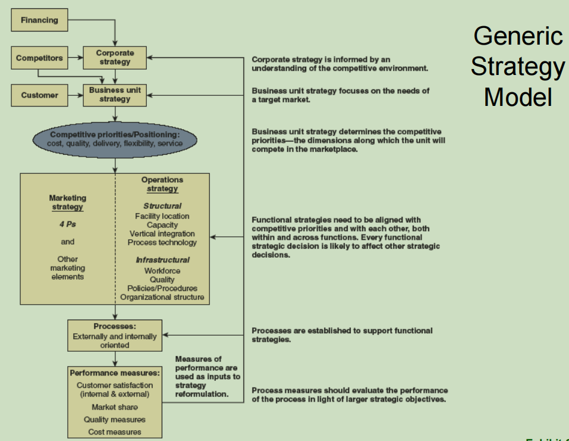
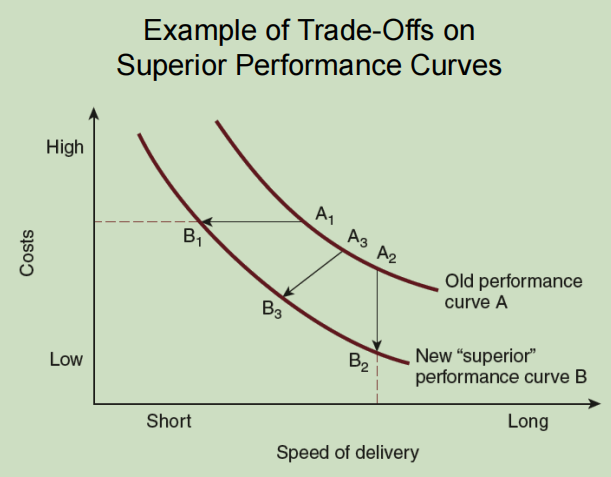

[<< Previous](https://eclairjit.github.io/intro-to-operations-management/4_Relevance_of_Operations_Management)

# Operations Strategy - Detailed Notes

## 1. Introduction to Operations Strategy

- **Definition**: Operations strategy defines how a firm competes by aligning its operations with business objectives.
- **Objectives**:
  - Add value for customers.
  - Achieve competitive advantage.
  - Manage trade-offs among different operational strategies.
  - Integrate manufacturing and services for a complete customer experience.

## 2. Managerial Issues in Operations Strategy

- **Challenges**:
  - Increasing global competition.
  - Keeping up with technological advances.
  - Reducing costs while maintaining quality.
  - Innovating to stay ahead of competitors.
  - Long-term strategic planning for sustainable growth.

## 3. History and Evolution of Operations Strategy

- **Early Focus**:
  - Historically, corporate strategy was driven by marketing and finance.
  - Operations strategy became critical with increased competition and global supply chains.
- **Wickham Skinner’s Contributions**:
  - Advocated for operations as a competitive weapon.
  - Introduced concepts of strategic alignment in manufacturing.

## 4. Operations Strategy and Customer Value

- $Perceived \ Customer \ Value = \frac{Total \ Benefits}{Total \ Costs}$
- $Perceived \ Customer \ Value = Total \ Benefits - Total \ Costs$
- **Ways to Increase Value**:
  - Reduce product costs.
  - Improve availability.
  - Enhance service speed.
  - Provide additional relevant information.
  - Offer product customization.

## 5. Trends Affecting Operations Strategy

- **Globalization**:
  - Lower trade barriers and transportation costs.
  - Increased competition from newly industrialized countries.
- **Technology**:
  - Faster, more connected operations.
  - Innovation in services and data analytics.
- **Competing on Multiple Priorities**:
  - Firms must focus on cost, quality, delivery, flexibility, and service simultaneously.

## 6. The Generic Strategy Model

- **Competitive Priorities**:
  - **Cost**: Low-cost production and efficiency.
  - **Quality**: High product and process quality.
  - **Delivery**: Fast and reliable product availability.
  - **Flexibility**: Adaptable product variety and customization.
  - **Service**: Value-added services beyond the product itself.
- **New Competitive Advantages**:

  - Eco-friendly processes and sustainability.
  - Leveraging big data for operational improvements.

  

## 7. Core Concepts in Operations Strategy

- **Critical Success Factors**:
  - Key activities and conditions required to achieve business goals.
- **Distinctive Competencies**:
  - Unique capabilities that set a firm apart in the marketplace.
  - Long-term sustainable competitive advantages.
- **Corporate and Functional Strategies**:
  - **Corporate Strategy**: Defines overall business direction.
  - **Strategic Business Units (SBU)**: Independent business segments.
  - **Functional Strategies**: Department-specific strategies (e.g., marketing, HR, operations).
  - **Operations Strategy**: Specific operational practices that support business goals.

## 8. Structural and Infrastructural Decisions in OM

- **Structural Decisions**:
  - Facility location choices.
  - Capacity planning.
  - Vertical integration (controlling supply chain elements).
  - Process technology selection.
- **Infrastructural Decisions**:
  - Workforce policies and hiring strategies.
  - Quality management systems.
  - Standardized operational policies.
  - Organizational hierarchy and decision-making frameworks.

## 9. Trade-Offs in Operations Strategy

- **Traditional View**:
  - Factories could only focus on one or two competitive priorities.
  - Trade-offs existed between cost, quality, delivery, and flexibility.
- **Modern View**:

  - Advances in technology allow firms to excel in multiple areas.
  - World-class operations aim for simultaneous improvement in all priorities.
  - **Plant-within-a-Plant (PWP) Concept**: Different sections of a facility specialize in different priorities.

  

## 10. Order Qualifiers and Order Winners

- **Order Qualifiers**:
  - Minimum standards a product must meet to be considered for purchase.
  - Example: Airlines must meet safety regulations to operate.
- **Order Winners**:
  - Unique product characteristics that set a firm apart from competitors.
  - Example: An airline known for superior customer service.

## 11. Contemporary Issues in Operations Strategy

- **Focusing on Core Capabilities**:
  - Firms specialize in their strongest areas and outsource non-core activities.
- **Integrating Manufacturing and Services**:
  - Providing a combination of products and services enhances customer satisfaction.
  - Example: Car manufacturers offering financing and maintenance services.

## 12. Methods for Integrating Manufacturing and Services

- **Customer Involvement**:
  - Providing transparency in production processes.
  - Example: Open kitchens in restaurants.
- **Customer Training**:
  - Educating customers to maximize product utility.
  - Example: Software companies providing training programs.

## 13. Summary

- Operations strategy is essential for achieving competitive advantage.
- Companies must align operations with business goals to maximize efficiency and value.
- Trends like globalization, technology, and sustainability are reshaping operations strategies.
- Balancing cost, quality, flexibility, and speed is key to modern operational success.
- Integration of services and manufacturing enhances customer satisfaction and business resilience.

[Next >>](https://eclairjit.github.io/intro-to-operations-management/6_Technology_in_Operations_Management)
