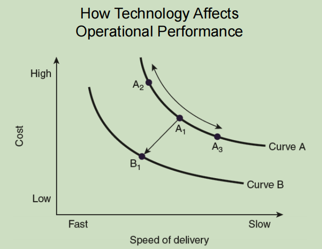

[<< Previous](https://eclairjit.github.io/intro-to-operations-management/5_Operations_Strategy)

# The Role of Technology in Operations Management - Detailed Notes

## 1. Introduction to Technology in OM

- **Technology's Role**: Enhances efficiency, reduces costs, and improves decision-making in operations.
- **Objectives**:
  - Understand different types of information systems.
  - Learn how technology adds value to operations.
  - Explore the impact of Enterprise Resource Planning (ERP) and other software.
  - Understand technology's integration into service operations.
  - Define different types of e-services.

## 2. Managerial Issues in Technology Adoption

- **Technology as a Tool**: Must align with business goals and not be implemented for its own sake.
- **Challenges**:
  - Keeping up with rapid advancements.
  - Maintaining system compatibility.
  - Training employees to use new technologies effectively.
  - Ensuring continuous updates and cybersecurity measures.

## 3. Types of Computer Information Systems

- **Management Information Systems (MIS)**: Reports on operational effectiveness and supports decision-making.
- **Finance & Accounting Systems**: Handles sales transactions and financial reporting.
- **Decision Support Systems (DSS)**: Uses data mining and predictive analytics to aid decision-making.
- **Marketing Information Systems**: Analyzes consumer trends and preferences.
- **Executive Information Systems (EIS)**: Helps top management access operational insights.
- **Artificial Intelligence (AI)**: Includes speech recognition, visual recognition, and predictive modeling.

## 4. Technology in Manufacturing

- **Automation Technologies**:
  - **Machining Centers**: Automated tool changes within a manufacturing process.
  - **Numerically Controlled (NC) Machines**: Directly controlled by a computer.
  - **Industrial Robots**: Perform repetitive or complex manufacturing tasks.
- **Computer-Aided Design & Manufacturing (CAD/CAM)**:
  - **CAD**: Digital design tools for product development.
  - **CAM**: Integrates CAD designs into production.
- **Flexible Manufacturing Systems (FMS)**:
  - Automated facilities that produce a variety of products.
- **Computer-Integrated Manufacturing (CIM)**:
  - Fully automated production controlled by integrated computer systems.

## 5. Information Technology in Operations

- **Key Software Systems**:
  - **Enterprise Resource Planning (ERP)**: Centralizes all business functions into one database.
  - **Supply Chain Management (SCM)**: Manages supplier relationships and logistics.
  - **New Product Development (NPD)**: Connects engineering with operations for product innovation.
  - **Customer Relationship Management (CRM)**: Manages interactions with customers to improve service.

## 6. Evolution of ERP Systems

- **Origins**: Developed from Material Requirements Planning (MRP) in the 1960s-70s.
- **Benefits**:
  - Reduces database errors.
  - Improves customer response time.
  - Enhances order fulfillment speed.
  - Improves communication across departments.
- **Challenges**:
  - High implementation costs.
  - Requires top management commitment.
  - Employee training is necessary.
  - Standardized systems may lack flexibility.

## 7. Technology Trends in Services

- **Increase in Self-Service**:
  - Reduces labor costs.
  - Speeds up customer interactions (e.g., ATMs, self-checkouts).
- **Location Independence**:
  - Digital services reduce the need for physical locations.
- **Shift from Synchronous to Asynchronous Services**:
  - Digital platforms enable anytime transactions (e.g., online banking, e-commerce).
- **Disintermediation**:
  - Direct connections between buyers and sellers reduce intermediaries.

## 8. Integrating Technology into Service Operations

- **Key Benefits**:
  - Increases efficiency.
  - Enhances customer service.
  - Enables faster response times.
- **Areas for Integration**:
  - Strategic planning.
  - Service customization.
  - Performance tracking and data analytics.
- **Examples**:
  - Online clothing retailers offering virtual fitting rooms.
  - AI-powered chatbots handling customer service queries.

## 9. Categories of E-Services

| Category                              | Function                                                  |
| ------------------------------------- | --------------------------------------------------------- |
| **Internet**                          | Open access website services.                             |
| **Intranet**                          | Internal network for employees only.                      |
| **Extranet**                          | Limited access network for external users like suppliers. |
| **Electronic Data Interchange (EDI)** | Facilitates data exchange with vendors and suppliers.     |
| **Value-Added Networks (VAN)**        | Third-party services supporting data transfers.           |

## 10. Types of E-Services

- **Business-to-Consumer (B2C)**: Online retail, customer service portals.
- **Consumer-to-Consumer (C2C)**: Peer-to-peer marketplaces (e.g., eBay, Craigslist).
- **Business-to-Business (B2B)**: Corporate procurement and supplier networks.
- **Government-to-Business (G2B)**: Online government services for businesses (e.g., tax filings).
- **Government-to-Consumer (G2C)**: Digital public services (e.g., passport applications, online bill payments).

## 11. Challenges for E-Tailers

- **Infrastructure Issues**:
  - Efficient supply chain and logistics required for fast delivery.
- **Lack of Tangibility**:
  - Customers may hesitate due to the inability to physically inspect products.
- **Differentiation Strategies**:
  - Unique features and better service help e-tailers compete.

## 12. Technology-Related Issues in Operations

- **Overcoming Customer Barriers**:
  - Educating customers about new technologies.
  - Providing training for employees to use technology effectively.
- **Ethics and Privacy**:
  - Concerns over data security and employee monitoring.
  - Compliance with ethical guidelines in technology use.

## 13. Summary

- Technology plays a crucial role in both manufacturing and service operations.
- Key innovations include automation, ERP, AI, and self-service technologies.
- Digital transformation enables businesses to compete in a global marketplace.
- Companies must balance technology adoption with usability, security, and customer needs.

[Next >>](https://eclairjit.github.io/intro-to-operations-management/7_The_Service_Encounter)
