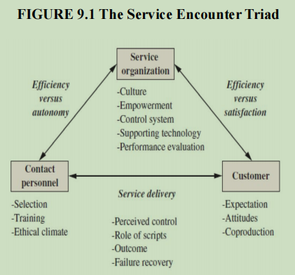
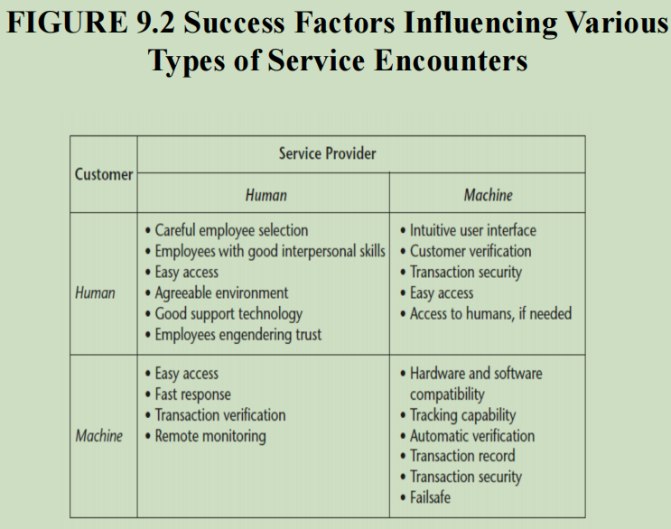

# The Service Encounter - Detailed Notes

## 1. Introduction to the Service Encounter

- **Definition**: The interaction between a service provider and a customer, which influences the customer’s perception of service quality.
- **Moment of Truth**: Coined by Richard Normann, every service encounter is an opportunity to shape customer perception.
- **Service Encounter Triad**: Involves three key participants:

  1. **Customer**: Evaluates service quality and seeks control over the interaction.
  2. **Service Organization**: Sets procedures, environment, and rules to ensure efficiency.
  3. **Contact Personnel**: Execute service delivery and balance customer satisfaction with operational guidelines.

  

## 2. Types of Service Encounter Dynamics

### a) Organization-Dominated Encounter

- **Characteristics**:
  - Standardized services with minimal customization.
  - Strict rules and procedures limit employee discretion.
  - Example: Fast food chains like McDonald’s and Jiffy Lube.
- **Pros**:
  - Ensures cost efficiency and consistency.
  - Easier management of large-scale operations.
- **Cons**:
  - Limits personalized customer service.
  - Potential for customer dissatisfaction due to rigidity.

### b) Contact Personnel-Dominated Encounter

- **Characteristics**:
  - Service personnel control the interaction.
  - Customers rely on the expertise of service providers.
  - Example: Doctor-patient relationships, where doctors have significant control over service delivery.
- **Pros**:
  - Can create trust and efficiency in expertise-driven services.
- **Cons**:
  - Customers may feel powerless or uninformed.
  - Potential inefficiencies due to staff autonomy.

### c) Customer-Dominated Encounter

- **Characteristics**:
  - Self-service options place control in the hands of customers.
  - Examples: Self-checkout stations, online booking systems.
- **Pros**:
  - Provides convenience and speed.
  - Reduces labor costs for the organization.
- **Cons**:
  - Not suitable for complex, personalized services.
  - Customers may struggle with unfamiliar systems.

## 3. Measuring Service Encounters

- **E-S-QUAL Framework** (for online services):
  1. **Efficiency**: Ease of navigation and usability.
  2. **System Availability**: Reliable, uninterrupted service.
  3. **Fulfillment**: Timely and accurate service delivery.
  4. **Privacy**: Protection of customer data and transactions.

## 4. The Role of the Service Organization

- **Culture & Environment**:
  - Shapes customer and employee interactions.
  - Affects service quality and consistency.
- **Key Elements**:
  - Establishing clear service values.
  - Ensuring effective communication and training.
  - Encouraging employee autonomy for better decision-making.

## 5. Employee Empowerment in Service Encounters

- **Definition**: Giving employees the authority and responsibility to make decisions.
- **Elements of Empowerment**:
  1. **Investing in Employees**: Training and development.
  2. **Using Technology to Support (not Replace) Employees**.
  3. **Recruitment & Training**: Prioritizing customer service skills.
  4. **Linking Compensation to Performance**.
- **Impact on Middle Management**:
  - Shift from supervisory roles to facilitators of frontline employees.

## 6. The Role of Contact Personnel

- **Essential Attributes**:
  1. Flexibility
  2. Tolerance for ambiguity
  3. Adaptability based on customer needs
  4. Empathy and customer-focused mindset
- **Customer-Employee Interaction**:
  - Customers seek personalized experiences.
  - Employees must balance customer expectations with organizational policies.

## 7. Customer Expectations & Attitudes

- Customers seek services based on different motivations:
  1. **Economizing Customer**: Seeks maximum value for money and efficiency.
  2. **Ethical Customer**: Prefers socially responsible businesses.
  3. **Personalizing Customer**: Values interpersonal interaction and recognition.
  4. **Convenience Customer**: Prioritizes speed and ease of access.
- **Impact of Customer Behavior**:
  - Businesses must tailor their service approach to different customer types.

## 8. The Role of Scripts in Customer Coproduction

- **Definition**: Customers follow expected behavioral patterns during service encounters.
- **Examples**:
  - Fast-food customers are expected to clean up after eating.
  - Self-checkout users follow a specific process to complete their purchase.
- **Challenges**:
  - Resistance to new service processes (e.g., learning to use self-service kiosks).
  - Need for staff assistance during transitions to automated systems.

## 9. Evolving Nature of Service Encounters

- **Technological Integration**:
  - Online service encounters (e.g., chatbots, virtual assistants) replace human interaction.
  - Self-service solutions continue to expand across industries.
- **Types of Service Interactions**:
  1. **Human-to-Human**: Traditional service encounters (e.g., customer service representatives).
  2. **Machine-to-Human**: ATMs, online booking systems.
  3. **Machine-to-Machine**: Automated logistics and supply chain management.
  4. **Human-to-Machine**: Technical support, equipment maintenance services.

## 10. Creating a Customer Service-Oriented Organization

- **Link Between Employee and Customer Satisfaction**:
  - Employees who perceive a strong service culture deliver superior customer experiences.
- **Success Factors**:
  1. Strong leadership emphasizing customer service.
  2. Clear communication of service values.
  3. Consistent training and development.
  4. Employee recognition and reward systems.

 

## 11. Summary

- The service encounter is a critical moment in service delivery.
- Three main participants: customer, service organization, and contact personnel.
- Service encounters can be dominated by the organization, employees, or customers.
- Employee empowerment and organizational culture shape service quality.
- Customer attitudes and expectations influence service experiences.
- Technological advancements continue to redefine service encounters.
